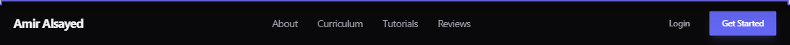
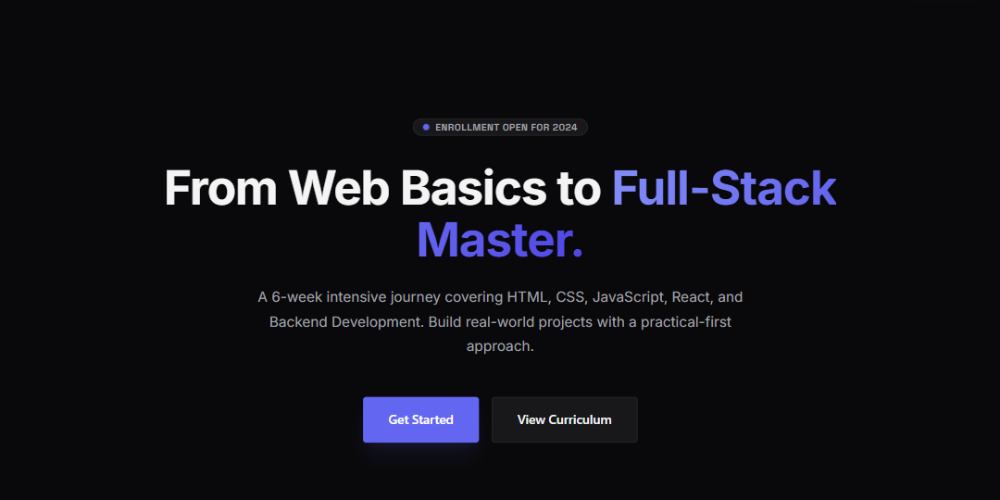
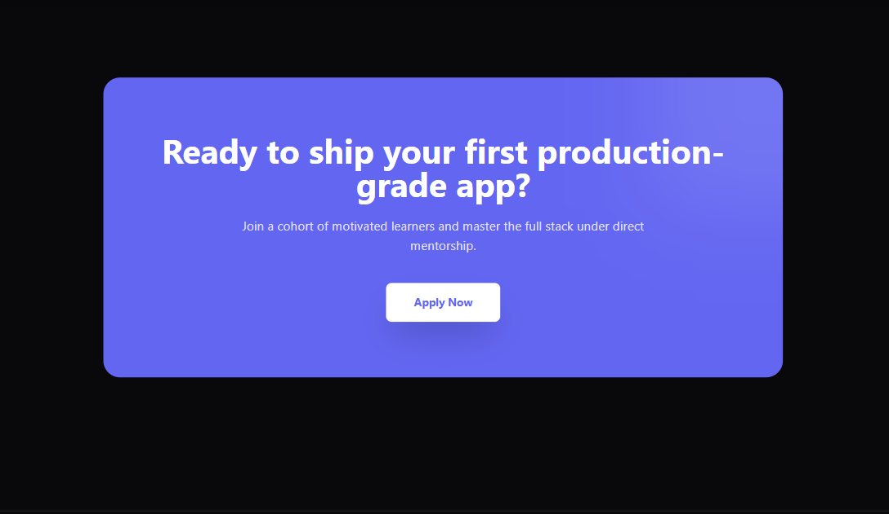
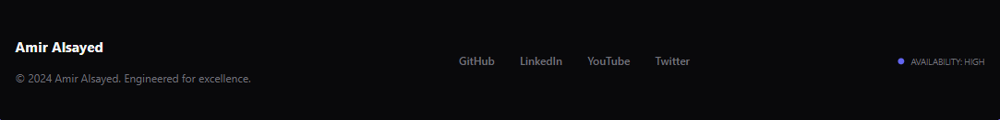

# React Lab 01: Building Your First Professional Landing Page

## **الهدف من اللاب:**

تطبيق المفاهيم الأساسية التي تم شرحها في المحاضرة:

1. إعداد بيئة العمل باستخدام **Vite** و **Tailwind CSS**.
2. فهم هيكلة المجلدات (Folder Structure).
3. تقسيم الواجهة إلى مكونات قابلة لإعادة الاستخدام (**Components**).
4. استخدام الـ **JSX** والـ **Props** البسيطة.
5. تجميع المكونات داخل صفحة واحدة (**Home Page**).

---

## **الخطوة الأولى: إعداد المشروع (Project Setup)**

1. قم بفتح الـ Terminal في المجلد الذي تريده ونفذ الأمر التالي لإنشاء مشروع جديد:

```bash
npm create vite@latest
```

ثم اختر اسم المشروع, لغة المشروع و ال framework 2. ادخل إلى مجلد المشروع:

```bash
cd my-portfolio
```

3. قم بتثبيت المكتبات المطلوبة:

```bash
npm install
```

4. قم بتثبيت **Tailwind CSS** (اتبع الخطوات الرسمية):

   من هنا -
   https://tailwindcss.com/docs/installation/using-vite

```bash
npm install tailwindcss @tailwindcss/vite
```

5. في ملف `vite.config.js` قم بإضافة المسارات التالية:

```javascript
import { defineConfig } from "vite";
import react from "@vitejs/plugin-react";
import tailwindcss from "@tailwindcss/vite";

// https://vite.dev/config/
export default defineConfig({
  plugins: [react(), tailwindcss()],
});
```

6. في ملف `src/index.css` قم بإضافة توجيهات Tailwind:

```css
@import "tailwindcss";
```

---

## **الخطوة الثانية: تنظيم ملفات المشروع (Folder Structure)**

داخل مجلد `src` قم بإنشاء المجلدات التالية للحفاظ على نظافة الكود:

- 📂 `components`: لوضع العناصر الصغيرة التي تتكرر (Header, Footer, etc).
- 📂 `pages`: لوضع الصفحات الكاملة (Home).

---

## **الخطوة الثالثة: المكونات المطلوبة (The Components)**

مطلوب منك الآن إنشاء الملفات التالية داخل مجلد `src/components`:

### **1. Header.jsx** عملناه مع بعض

- **المطلوب:** يمكنك جلب الكود الذي قمنا بكتابته في المحاضرة من الـ Repo الخاص بي.
- **الوظيفة:** يحتوي على اللوجو (Amir Alsayed) والروابط (About, Curriculum, Tutorials, Reviews) وزر "Get Started".

### **2. Hero.jsx**


- **المطلوب:** بناء أول سكشن يظهر للمستخدم بناءً على التصميم (screen.png).
- **التفاصيل:**
  - عنوان كبير (Main Heading) بكلمات ملونة (From Web Basics to Full-Stack Master).
  - نص وصفي صغير تحته.
  - زرين: "Get Started" (خلفية زرقاء) و "View Curriculum" (خلفية شفافة بحدود).

### **3. CTA.jsx (Call To Action)**


- **المطلوب:** بناء السكشن الموجود في آخر التصميم بلون بنفسجي مميز.
- **التفاصيل:**
  - العنوان: "Ready to ship your first production-grade app?".
  - نص تشجيعي.
  - زر "Apply Now" في المنتصف.

### **4. Footer.jsx**


- **المطلوب:** بناء تذييل الصفحة.
- **التفاصيل:**
  - اللوجو على اليسار.
  - روابط السوشيال ميديا (GitHub, LinkedIn, YouTube, Twitter) في المنتصف.
  - حقوق الملكية (Copyright) على اليمين.

---

## **الخطوة الرابعة: تجميع الصفحة (The Home Page)**

داخل مجلد `src/pages` قم بإنشاء ملف باسم `Home.jsx`:

1. قم بعمل **Import** لكل المكونات التي أنشأتها (Header, Hero, CTA, Footer).
2. اجعل الدالة `Home` تعيد (return) هذه المكونات مرتبة داخل `<div>` واحد كالتالي:
```jsx
<Header />
<Hero />
{/* هنا سنتجاهل الأجزاء الأخرى مؤقتاً */}
<CTA />
<Footer />
```

---

## **الخطوة الخامسة: التشغيل النهائي (App.jsx)**

اذهب إلى ملف `src/App.jsx` وقم بمسح الكود الافتراضي، ثم استدعِ صفحة الـ `Home`:

```jsx
import Home from "./pages/Home";

function App() {
  return (
    <div className="bg-[#0A0A0A] min-height-screen text-white">
      <Home />
    </div>
  );
}

export default App;
```

---

## **💡 ملاحظات هامة للطلاب:**

- **التفكير بالمكونات:** تذكر أن كل سكشن هو "Function" مستقلة، حاول أن تجعل الكود منظماً.
- **Tailwind:** استخدم الألوان الداكنة `bg-[#0A0A0A]` لتقترب من التصميم الموجود في الصورة.
- **الصور:** بالنسبة للصور الموجودة في الـ Hero، يمكنك استخدام أي صورة مؤقتة من Unsplash أو وضع Placeholder.
- **الإبداع:** لا تلتزم بالكود حرفياً، حاول تجربة الألوان والـ Padding والـ Margin بنفسك لتفهم كيف يعمل التنسيق في React.

---

**بالتوفيق يا شباب! لو وقف قدامكم أي حاجة اسألوا فوراً.**
